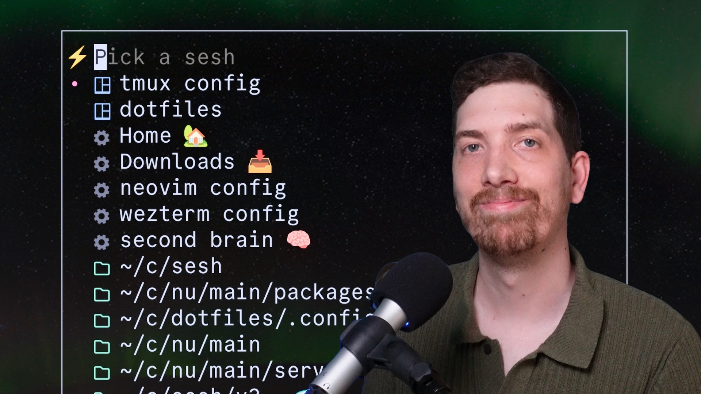

<p align="center">
  
</p>

<h1 align="center">Sesh, the smart terminal session manager</h1>

<p align="center">
  <a href="https://github.com/joshmedeski/sesh/actions/workflows/ci-cd.yml">
    
  </a>
  <a href="https://goreportcard.com/report/github.com/joshmedeski/sesh">
    
  </a>
  <a href="https://opensource.org/licenses/MIT">
    
  </a>
</p>

Sesh is a CLI that helps you create and manage tmux sessions quickly and easily using zoxide.

<div style="width:50%">
  <a href="https://youtu.be/-yX3GjZfb5Y?si=iFG8qNro1hmZjJFY" target="_blank">
    
  </a>
</div>

Watch the video to learn more about how to use sesh to manage your tmux sessions.

## How to install

<details>
  <summary>Homebrew</summary>

To install sesh, run the following [homebrew](https://brew.sh/) command:

```sh
brew install sesh
```

</details>

<details>
  <summary>Arch Linux AUR</summary>

To install sesh, run the following [yay](https://aur.archlinux.org/packages/yay) command:

```sh
yay -S sesh-bin
```

</details>

<details>
  <summary>Go</summary>

Alternatively, you can install Sesh using Go's go install command:

```sh
go install github.com/joshmedeski/sesh/v2@latest
```

This will download and install the latest version of Sesh. Make sure that your Go environment is properly set up.

</details>

<details>
  <summary>Nix</summary>

See the [nix package directory](https://search.nixos.org/packages?channel=unstable&show=sesh&from=0&size=50&sort=relevance&type=packages&query=sesh) for instructions on how to install sesh through the nix platform.

</details>

**Note:** Do you want this on another package manager? [Create an issue](https://github.com/joshmedeski/sesh/issues/new) and let me know!

## Raycast Extension

The [sesh companion extension](https://www.raycast.com/joshmedeski/sesh) for [Raycast](https://www.raycast.com/) makes it easy to use sesh outside of the terminal.

Here are limitations to keep in mind:

- tmux has to be running before you can use the extension
- The extension caches results for a few seconds, so it may not always be up to date

<a title="Install sesh Raycast Extension" href="https://www.raycast.com/joshmedeski/sesh"></a>

## How to use

### tmux for sessions

[tmux](https://github.com/tmux/tmux) is a powerful terminal multiplexer that allows you to create and manage multiple terminal sessions. Sesh is designed to make managing tmux sessions easier.

### zoxide for directories

[zoxide](https://github.com/ajeetdsouza/zoxide) is a blazing fast alternative to `cd` that tracks your most used directories. Sesh uses zoxide to manage your projects. You'll have to set up zoxide first, but once you do, you can use it to quickly jump to your most used directories.

### Basic usage

Once tmux and zoxide are setup, `sesh list` will list all your tmux sessions and zoxide results, and `sesh connect {session}` will connect to a session (automatically creating it if it doesn't exist yet). It is best used by integrating it into your shell and tmux.

#### fzf

The easiest way to integrate sesh into your workflow is to use [fzf](https://github.com/junegunn/fzf). You can use it to select a session to connect to:

```sh
sesh connect $(sesh list | fzf)
```

#### tmux + fzf

In order to integrate with tmux, you can add a binding to your tmux config (`tmux.conf`). For example, the following will bind `ctrl-a T` to open a fzf prompt as a tmux popup (using `fzf-tmux`) and using different commands to list active sessions (`sesh list -t`), configured sessions (`sesh list -c`), zoxide directories (`sesh list -z`), and find directories (`fd...`).

```sh
bind-key "T" run-shell "sesh connect \"$(
  sesh list --icons | fzf-tmux -p 80%,70% \
    --no-sort --ansi --border-label ' sesh ' --prompt '⚡  ' \
    --header '  ^a all ^t tmux ^g configs ^x zoxide ^d tmux kill ^f find' \
    --bind 'tab:down,btab:up' \
    --bind 'ctrl-a:change-prompt(⚡  )+reload(sesh list --icons)' \
    --bind 'ctrl-t:change-prompt(🪟  )+reload(sesh list -t --icons)' \
    --bind 'ctrl-g:change-prompt(⚙️  )+reload(sesh list -c --icons)' \
    --bind 'ctrl-x:change-prompt(📁  )+reload(sesh list -z --icons)' \
    --bind 'ctrl-f:change-prompt(🔎  )+reload(fd -H -d 2 -t d -E .Trash . ~)' \
    --bind 'ctrl-d:execute(tmux kill-session -t {2..})+change-prompt(⚡  )+reload(sesh list --icons)' \
    --preview-window 'right:55%' \
    --preview 'sesh preview {}'
)\""
```

You can customize this however you want, see `man fzf` for more info on the different options.

## gum + tmux

If you prefer to use [charmblacelet's gum](https://github.com/charmbracelet/gum) then you can use the following command to connect to a session:

```sh
bind-key "K" display-popup -E -w 40% "sesh connect \"$(
 sesh list -i | gum filter --limit 1 --no-sort --fuzzy --placeholder 'Pick a sesh' --height 50 --prompt='⚡'
)\""
```

**Note:** There are less features available with gum compared to fzf, but I found its matching algorithm is faster and it has a more modern feel.

> [!WARNING]
> As of [gum v0.15.0](https://github.com/charmbracelet/gum/releases/tag/v0.15.0) you have to add the `--no-strip-ansi` in order to display the icons correctly.

See my video, [Top 4 Fuzzy CLIs](https://www.youtube.com/watch?v=T0O2qrOhauY) for more inspiration for tooling that can be integrated with sesh.

## zsh keybind

If you use zsh, you can add the following keybind to your `.zshrc` to connect to a session:

```sh
function sesh-sessions() {
  {
    exec </dev/tty
    exec <&1
    local session
    session=$(sesh list -t -c | fzf --height 40% --reverse --border-label ' sesh ' --border --prompt '⚡  ')
    zle reset-prompt > /dev/null 2>&1 || true
    [[ -z "$session" ]] && return
    sesh connect $session
  }
}

zle     -N             sesh-sessions
bindkey -M emacs '\es' sesh-sessions
bindkey -M vicmd '\es' sesh-sessions
bindkey -M viins '\es' sesh-sessions
```

After adding this to your `.zshrc`, you can press `Alt-s` to open a fzf prompt to connect to a session.

## Recommended tmux Settings

I recommend you add these settings to your `tmux.conf` to have a better experience with this plugin.

```sh
bind-key x kill-pane # skip "kill-pane 1? (y/n)" prompt
set -g detach-on-destroy off  # don't exit from tmux when closing a session
```

## Bonus

### Last

The default `<prefix>+L` command will "Switch the attached client back to the last session." However, if you close a session while `detach-on-destroy off` is set, the last session will not be found. To fix this, I have a `sesh last` command that will always switch the client to the second to last session that has been attached.

Add the following to your `tmux.conf` to overwrite the default `last-session` command:

```sh
bind -N "last-session (via sesh) " L run-shell "sesh last"
```

### Connect to root

While working in a nested session, you may way to connect to the root session of a git worktree or git repository. To do this, you can use the `--root` flag with the `sesh connect` command.

I recommend adding this to your `tmux.conf`:

```sh
bind -N "switch to root session (via sesh) " 9 run-shell "sesh connect --root \'$(pwd)\'"
```

### Filter by root

If you want to filter your search by the root of the active project, you can modify your piker by using the `sesh root` command:

```sh
bind-key "R" display-popup -E -w 40% "sesh connect \"$(
  sesh list -i -H | gum filter --value \"$(sesh root)\" --limit 1 --fuzzy --no-sort --placeholder 'Pick a sesh' --prompt='⚡'readme
)\""
```

I have this bound to `<prefix>+R` so I can use an alternative binding.

**Note:** This will only work if you are in a git worktree or git repository. For now, git worktrees expect a `.bare` folder.

## Configuration

You can configure sesh by creating a `sesh.toml` file in your `$XDG_CONFIG_HOME/sesh` or `$HOME/.config/sesh` directory.

```sh
mkdir -p ~/.config/sesh && touch ~/.config/sesh/sesh.toml
```

### Blacklist

You may want to blacklist certain tmux sessions from showing up in the results. For example, you may want to exclude your `scratch` directory from the results.

```sh
blacklist = ["scratch"]
```

> [!NOTE] 
> Works great with [tmux-floatx](https://github.com/omerxx/tmux-floax)

### Default Session

The default session can be configured to run a command when connecting to a session. This is useful for running a dev server or starting a tmux plugin.

Additionally, you can define a preview command that runs when previewing the session's directory. This can be handy for displaying files with tools like [eza](https://github.com/eza-community/eza) or [lsd](https://github.com/lsd-rs/lsd).

Note: The `{}` will be automatically replaced with the session's path.

```toml
[default_session]
startup_command = "nvim -c ':Telescope find_files'"
preview_command = "eza --all --git --icons --color=always {}"
```

If you want to disable the default start command on a specific session, you can set `disable_startup_command = true`.

### Session Configuration

A startup command is a command that is run when a session is created. It is useful for setting up your environment for a given project. For example, you may want to run `npm run dev` to automatically start a dev server.

**Note:** If you use the `--command/-c` flag, then the startup script will not be run.

I like to use a command that opens nvim on session startup.

You can also define a preview command to display the contents of a specific file using [bat](https://github.com/sharkdp/bat) or any another file previewer of your choice.

```toml
[[session]]
name = "Downloads 📥"
path = "~/Downloads"
startup_command = "ls"

[[session]]
name = "tmux config"
path = "~/c/dotfiles/.config/tmux"
startup_command = "nvim tmux.conf"
preview_command = "bat --color=always ~/c/dotfiles/.config/tmux/tmux.conf"
```

### Listing Configurations

Session configurations will load by default if no flags are provided (the return after tmux sessions and before zoxide results). If you want to explicitly list them, you can use the `-c` flag.

```sh
sesh list -c
```

Set the file as an executable and it will be run when you connect to the specified session.

## Background (the "t" script)

Sesh is the successor to my popular [t-smart-tmux-session-manager](https://github.com/joshmedeski/t-smart-tmux-session-manager) tmux plugin. After a year of development and over 250 stars, it's clear that people enjoy the idea of a smart session manager. However, I've always felt that the tmux plugin was a bit of a hack. It's a bash script that runs in the background and parses the output of tmux commands. It works, but it's not ideal and isn't flexible enough to support other terminal multiplexers.

I've decided to start over and build a session manager from the ground up. This time, I'm using a language that's more suited for the task: Go. Go is a compiled language that's fast, statically typed, and has a great standard library. It's perfect for a project like this. I've also decided to make this session manager multiplexer agnostic. It will be able to work with any terminal multiplexer, including tmux, zellij, Wezterm, and more.

The first step is to build a CLI that can interact with tmux and be a drop-in replacement for my previous tmux plugin. Once that's complete, I'll extend it to support other terminal multiplexers.

## Contributors

<a href="https://github.com/joshmedeski/sesh/graphs/contributors">
  
</a>

Made with [contrib.rocks](https://contrib.rocks).

## Star History

[](https://www.star-history.com/#joshmedeski/sesh&Date)
