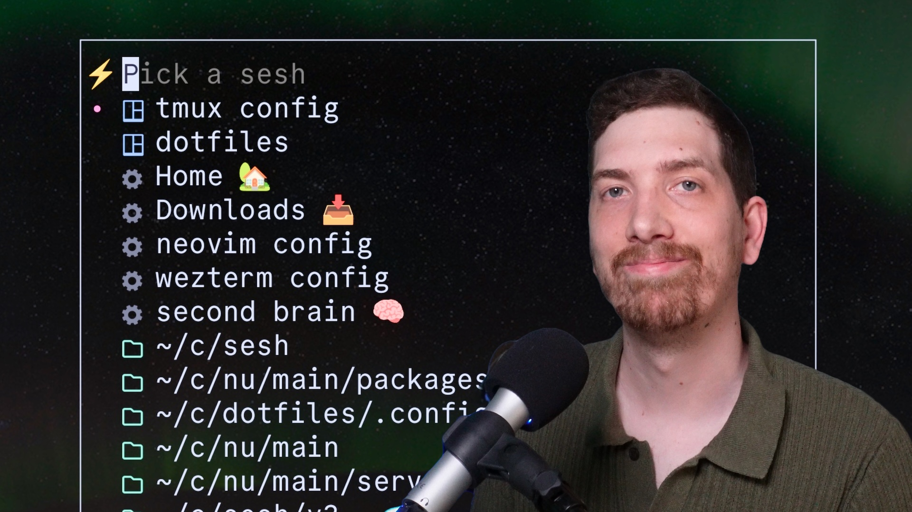

<p align="center">
  
</p>

<h1 align="center">Sesh，智能终端会话管理器</h1>

<p align="center">
  <a href="https://github.com/joshmedeski/sesh/actions/workflows/ci-cd.yml">
    
  </a>
  <a href="https://goreportcard.com/report/github.com/joshmedeski/sesh">
    
  </a>
  <a href="https://opensource.org/licenses/MIT">
    
  </a>
</p>

<div align="center">

[English](README.md) | [简体中文](README.zh-cn.md)

</div>

Sesh 是一个 CLI 工具，可帮助您使用 zoxide 快速轻松地创建和管理 tmux 会话。

<div style="width:50%">
  <a href="https://youtu.be/-yX3GjZfb5Y?si=iFG8qNro1hmZjJFY" target="_blank">
    
  </a>
</div>

观看视频，了解有关如何使用 sesh 管理 tmux 会话的更多信息。

## 如何安装

<details>
  <summary>Homebrew</summary>

要安装 sesh，请运行以下 [homebrew](https://brew.sh/) 命令：

```sh
brew install sesh
```

</details>

<details>
  <summary>Arch Linux AUR</summary>

要安装 sesh，请运行以下 [yay](https://aur.archlinux.org/packages/yay) 命令：

```sh
yay -S sesh-bin
```

</details>

<details>
  <summary>Fedora（Copr）</summary>

可以从 [buckaroogeek/Tmux_sesh](https://copr.fedorainfracloud.org/coprs/buckaroogeek/Tmux_sesh/) Copr 仓库安装 sesh（支持 Fedora 和 EPEL 10）：

```sh
sudo dnf copr enable buckaroogeek/Tmux_sesh
sudo dnf install tmux-sesh
```

</details>

<details>
  <summary>Go</summary>

或者，您可以使用 Go 的 `go install` 命令安装 Sesh：

```sh
go install github.com/joshmedeski/sesh/v2@latest
```

这将下载并安装最新版本的 Sesh。请确保您的 Go 环境已正确设置。

</details>

<details>
  <summary>Conda</summary>

要安装 sesh，请根据您的设置运行以下 **其中一个** 命令：

* Conda/(micro)mamba 用户
```sh
# 如果需要，请替换为 mamba/micromamba
conda -c conda-forge install sesh
```

* Pixi 用户
```sh
pixi global install sesh
```

</details>

<details>
  <summary>Nix</summary>

有关如何通过 nix 平台安装 sesh 的说明，请参阅 [nix 软件包目录](https://search.nixos.org/packages?channel=unstable&show=sesh&from=0&size=50&sort=relevance&type=packages&query=sesh)。

</details>

**注意：** 您希望在其他包管理器上使用它吗？[创建一个 issue](https://github.com/joshmedeski/sesh/issues/new) 让我知道！

## Shell 补全

Sesh 支持 Bash、Zsh、Fish 和 PowerShell 的 shell 补全（tab 补全）。这可以帮助您通过按 Tab 键发现命令、标志和参数。

<details>
  <summary>Bash</summary>

```sh
# 生成补全脚本
sesh completion bash > sesh-completion.bash

# 系统范围安装（推荐）
sudo cp sesh-completion.bash /etc/bash_completion.d/

# 或仅为当前用户安装
mkdir -p ~/.local/share/bash-completion/completions
cp sesh-completion.bash ~/.local/share/bash-completion/completions/sesh

# 重新加载您的 shell
source ~/.bashrc
```

</details>

<details>
  <summary>Zsh</summary>

```sh
# 生成补全脚本
sesh completion zsh > _sesh

# 系统范围安装（推荐）
sudo mkdir -p /usr/local/share/zsh/site-functions
sudo cp _sesh /usr/local/share/zsh/site-functions/

# 或仅为当前用户安装
mkdir -p ~/.zsh/completions
cp _sesh ~/.zsh/completions/
echo 'fpath=(~/.zsh/completions $fpath)' >> ~/.zshrc
echo 'autoload -U compinit && compinit' >> ~/.zshrc

# 重新加载您的 shell
source ~/.zshrc
```

</details>

<details>
  <summary>Fish</summary>

```sh
# 生成并安装补全
sesh completion fish > ~/.config/fish/completions/sesh.fish

# 重新加载 fish 配置
source ~/.config/fish/config.fish
```

</details>

<details>
  <summary>PowerShell</summary>

```powershell
# 生成补全脚本
sesh completion powershell > sesh.ps1

# 如果 PowerShell 配置文件目录不存在，则创建它
mkdir -p (Split-Path $PROFILE)

# 添加到 PowerShell 配置文件
Add-Content $PROFILE ". /path/to/sesh.ps1"

# 重新加载 PowerShell
& $PROFILE
```

</details>

设置补全后，您可以在键入 `sesh` 时按 Tab 键以查看可用的命令、标志和参数。

## 扩展

## Raycast 扩展

适用于 [Raycast](https://www.raycast.com/) 的 [sesh 配套扩展](https://www.raycast.com/joshmedeski/sesh) 使在终端外使用 sesh 变得容易。

请记住以下限制：

- 在使用扩展之前，tmux 必须正在运行
- 扩展会缓存几秒钟的结果，因此可能不总是最新的

<a title="Install sesh Raycast Extension" href="https://www.raycast.com/joshmedeski/sesh"></a>

## Ulauncher 扩展

对于使用 [Ulauncher](https://ulauncher.io/) 的 Linux 用户，有两个扩展可以在终端外使用 sesh：
- [Sesh Session Manager](https://ext.ulauncher.io/-/github-jacostag-sesh-ulauncher)
- [SESHion Manager](https://ext.ulauncher.io/-/github-mrinfinidy-seshion-manager)

以下是 Sesh Session Manager 需要注意的限制：

- 在使用扩展之前，tmux 必须正在运行


## Walker 启动器用法 (Linux)

直接在 `$XDG_CONFIG_HOME/config.toml` 上创建一个动作


```
[[plugins]]
name = "sesh"
prefix = ";s "
src_once = "sesh list -d -c -t -T"
cmd = "sesh connect --switch %RESULT%"
keep_sort = false
recalculate_score = true
show_icon_when_single = true
switcher_only = true
```

### 对于 dmenu 模式，您可以使用：

#### Fish shell:
set ssession $(sesh l -t -T -d -H | walker -d -f -k -p "Sesh sessions"); sesh cn --switch $ssession

#### Bash/Zsh:
ssession=$(sesh l -t -T -d -H | walker -d -f -k -p "Sesh sessions"); sesh cn --switch $ssession

##### 对于 dmenu 启动器，请将 walker -dfk 替换为 dmenu 或 rofi)

### 如何使用

### 用于会话的 tmux

[tmux](https://github.com/tmux/tmux) 是一个功能强大的终端多路复用器，可让您创建和管理多个终端会话。Sesh 旨在使管理 tmux 会话更容易。

### 用于目录的 zoxide

[zoxide](https://github.com/ajeetdsouza/zoxide) 是 `cd` 的一个极速替代品，可以跟踪您最常用的目录。Sesh 使用 zoxide 来管理您的项目。您必须先设置 zoxide，但一旦完成，您就可以使用它快速跳转到您最常用的目录。

### 基本用法

一旦 tmux 和 zoxide 设置好，`sesh list` 将列出您所有的 tmux 会话和 zoxide 结果，而 `sesh connect {session}` 将连接到一个会话（如果尚不存在，则自动创建）。最好通过将其集成到您的 shell 和 tmux 中来使用。

#### fzf

将 sesh 集成到工作流中的最简单方法是使用 [fzf](https://github.com/junegunn/fzf)。您可以用它来选择要连接的会话：

```sh
sesh connect $(sesh list | fzf)
```

#### tmux + fzf

为了与 tmux 集成，您可以向 tmux 配置（`tmux.conf`）添加一个绑定。例如，以下命令会将 `ctrl-a T` 绑定为以 tmux 弹出窗口的形式打开 fzf 提示（使用 `fzf-tmux`），并使用不同的命令列出活动会话（`sesh list -t`）、已配置的会话（`sesh list -c`）、zoxide 目录（`sesh list -z`）和查找目录（`fd...`）。

```sh
bind-key "T" run-shell "sesh connect "$(
  sesh list --icons | fzf-tmux -p 80%,70% \
    --no-sort --ansi --border-label ' sesh ' --prompt '⚡  ' \
    --header '  ^a all ^t tmux ^g configs ^x zoxide ^d tmux kill ^f find' \
    --bind 'tab:down,btab:up' \
    --bind 'ctrl-a:change-prompt(⚡  )+reload(sesh list --icons)' \
    --bind 'ctrl-t:change-prompt(🪟  )+reload(sesh list -t --icons)' \
    --bind 'ctrl-g:change-prompt(⚙️  )+reload(sesh list -c --icons)' \
    --bind 'ctrl-x:change-prompt(📁  )+reload(sesh list -z --icons)' \
    --bind 'ctrl-f:change-prompt(🔎  )+reload(fd -H -d 2 -t d -E .Trash . ~)' \
    --bind 'ctrl-d:execute(tmux kill-session -t {2..})+change-prompt(⚡  )+reload(sesh list --icons)' \
    --preview-window 'right:55%' \
    --preview 'sesh preview {}'
)""
```

您可以根据需要自定义此项，有关不同选项的更多信息，请参阅 `man fzf`。

#### tmux + [television](https://github.com/alexpasmantier/television)

如果您更喜欢使用 television 而不是 fzf，您可以向 tmux 配置添加一个绑定，在 tmux 弹出窗口中打开 [sesh 通道](https://alexpasmantier.github.io/television/docs/Users/community-channels-unix#sesh)。

```sh
bind-key "T" display-popup -E -w 80% -h 70% -d '#{pane_current_path}' -T 'Sesh' tv sesh
```

使用 `Ctrl-s` 循环浏览源，使用 `Ctrl-d` 终止高亮的会话。

## gum + tmux

如果您更喜欢使用 [charmbracelet's gum](https://github.com/charmbracelet/gum)，那么您可以使用以下命令连接到会话：

```sh
bind-key "K" display-popup -E -w 40% "sesh connect "$(
 sesh list -i | gum filter --limit 1 --no-sort --fuzzy --placeholder 'Pick a sesh' --height 50 --prompt='⚡'
)""
```

**注意：** 与 fzf 相比，gum 提供的功能较少，但我发现它的匹配算法更快，并且感觉更现代。

> [!WARNING]
> 从 [gum v0.15.0](https://github.com/charmbracelet/gum/releases/tag/v0.15.0) 开始，您必须添加 `--no-strip-ansi` 才能正确显示图标。

请参阅我的视频 [排名前 4 的模糊 CLI](https://www.youtube.com/watch?v=T0O2qrOhauY)，以获取更多可与 sesh 集成的工具灵感。

## zsh 键位绑定

如果您使用 zsh，可以将以下键位绑定添加到您的 `.zshrc` 文件中以连接到会话：

```sh
function sesh-sessions() {
  {
    exec </dev/tty
    exec <&1
    local session
    session=$(sesh list -t -c | fzf --height 40% --reverse --border-label ' sesh ' --border --prompt '⚡  ')
    zle reset-prompt > /dev/null 2>&1 || true
    [[ -z "$session" ]] && return
    sesh connect $session
  }
}

zle     -N             sesh-sessions
bindkey -M emacs '\es' sesh-sessions
bindkey -M vicmd '\es' sesh-sessions
bindkey -M viins '\es' sesh-sessions
```

将其添加到您的 `.zshrc` 后，您可以按 `Alt-s` 打开 fzf 提示以连接到会话。

## 推荐的 tmux 设置

我建议您将这些设置添加到您的 `tmux.conf` 中，以便更好地体验此插件。

```sh
bind-key x kill-pane # 跳过 "kill-pane 1? (y/n)" 提示
set -g detach-on-destroy off  # 关闭会话时不要退出 tmux
```

## 额外功能

### 上一个

默认的 `<prefix>+L` 命令将“将附加的客户端切换回上一个会话”。但是，如果在设置了 `detach-on-destroy off` 的情况下关闭会话，则找不到上一个会话。为了解决这个问题，我有一个 `sesh last` 命令，它将始终将客户端切换到倒数第二个已附加的会话。

将以下内容添加到您的 `tmux.conf` 中以覆盖默认的 `last-session` 命令：

```sh
bind -N "last-session (via sesh) " L run-shell "sesh last"
```

### 连接到根目录

在嵌套会话中工作时，您可能希望连接到 git worktree 或 git 存储库的根会话。为此，您可以将 `--root` 标志与 `sesh connect` 命令一起使用。

我建议将此添加到您的 `tmux.conf` 中：

```sh
bind -N "switch to root session (via sesh) " 9 run-shell "sesh connect --root $(pwd)"
```

### 按根目录筛选

如果要按活动项目的根目录筛选搜索，可以使用 `sesh root` 命令修改您的选择器：

```sh
bind-key "R" display-popup -E -w 40% "sesh connect "$(
  sesh list -i -H | gum filter --value "$(sesh root)" --limit 1 --fuzzy --no-sort --placeholder 'Pick a sesh' --prompt='⚡'readme
)""
```

我已将其绑定到 `<prefix>+R`，因此我可以使用备用绑定。

**注意：** 这仅在您位于 git worktree 或 git 存储库中时才有效。目前，git worktree 需要一个 `.bare` 文件夹。

## 配置

您可以通过在 `$XDG_CONFIG_HOME/sesh` 或 `$HOME/.config/sesh` 目录中创建 `sesh.toml` 文件来配置 sesh。

```sh
mkdir -p ~/.config/sesh && touch ~/.config/sesh/sesh.toml
```

### 自定义配置路径

您可以使用 `--config`（或 `-C`）标志指定自定义配置文件路径。这对于 NixOS 包装器、维护独立的工作/私人配置或测试非常有用。

```sh
sesh -C /path/to/custom/sesh.toml list
sesh --config /path/to/custom/sesh.toml connect my-session
```

该标志适用于任何子命令。指定时，文件必须存在，否则 sesh 将返回错误。如果没有该标志，sesh 将使用默认配置路径。

### 黑名单

您可能希望将某些 tmux 会话列入黑名单，使其不显示在结果中。例如，您可能希望从结果中排除 `scratch` 目录。

```sh
blacklist = ["scratch"]
```

### 目录长度

控制会话名称使用的目录组件数量。默认为 1（仅目录的基本名称）。

```toml
dir_length = 2  # 使用最后两个目录："projects/sesh" 而不是 "sesh"
```

> [!NOTE] 
> 与 [tmux-floax](https://github.com/omerxx/tmux-floax) 配合使用效果很好

### 排序

如果您想更改显示的会话顺序，可以在 `sesh.toml` 文件中配置 `sort_order`

```toml
sort_order = [
    "tmuxinator", # 首先显示
    "config",
    "tmux",
    "zoxide", # 最后显示
]
```

默认顺序是 `tmux`、`config`、`tmuxinator`，然后是 `zoxide`。

如果您只关心特定会话类型的顺序，可以省略它们。

```toml
sort_order = [
  "config", # 结果顺序：config, tmux, tmuxinator, zoxide
]
```

### 选择器 TUI

选择器 TUI 可以通过一些选项进行配置，以自定义其行为，这个选择器是外部模糊选择器的一个有用替代品。

```toml
[tui]
prompt = "> "
placeholder = "Filter sessions... "
show_icons = false
show_windows = false
```

当 `show_windows = true` 时，每一行还会在会话名称之后以暗色列出该会话中的窗口名称。放不下的窗口名称会汇总为 `+N`：

```
>  sesh editor server logs
   dotfiles nvim shell
   my-project code server db +2
   scratch
```

窗口名称仅用于显示：选中某一行仍然只返回会话名称，输入窗口名称也不会匹配到它所属的会话。活动 tmux 会话的窗口名称通过一次 tmux 调用获取，因此无论您有多少会话，该选项的开销都相同。

### 默认会话

可以配置默认会话以在连接到会话时运行命令。这对于运行开发服务器或启动 tmux 插件很有用。

此外，您可以定义一个在预览会话目录时运行的预览命令。这对于使用 [eza](https://github.com/eza-community/eza) 或 [lsd](https://github.com/lsd-rs/lsd) 等工具显示文件很方便。

注意：`{}` 将自动替换为会话的路径。

```toml
[default_session]
startup_command = "nvim -c ':Telescope find_files'"
preview_command = "eza --all --git --icons --color=always {}"
```

如果要在特定会话上禁用默认启动命令，可以设置 `disable_startup_command = true`。

### 会话配置

启动命令是在创建会话时运行的命令。它对于为给定项目设置环境非常有用。例如，您可能希望运行 `npm run dev` 来自动启动开发服务器。

**注意：** 如果使用 `--command/-c` 标志，则不会运行启动脚本。

我喜欢在会话启动时使用一个打开 nvim 的命令。

您还可以定义一个预览命令，以使用 [bat](https://github.com/sharkdp/bat) 或您选择的任何其他文件预览器显示特定文件的内容。

```toml
[[session]]
name = "Downloads 📥"
path = "~/Downloads"
startup_command = "ls"

[[session]]
name = "tmux config"
path = "~/c/dotfiles/.config/tmux"
startup_command = "nvim tmux.conf"
preview_command = "bat --color=always ~/c/dotfiles/.config/tmux/tmux.conf"
```

### 路径替换
如果要在启动或预览命令中使用所选会话的路径，可以使用 `{}` 占位符。  
在运行命令时，它将被替换为会话的路径。

一个使用示例是以下内容，其中 `tmuxinator` default_project 使用路径作为键/值对，使用 [ERB 语法](https://github.com/tmuxinator/tmuxinator?tab=readme-ov-file#erb)：
```toml
[default_session]
startup_command = "tmuxinator start default_project path={}"
preview_command = "eza --all --git --icons --color=always {}"
```

### 多个窗口

如果您希望会话有多个窗口，可以在配置中定义窗口。然后，您可以在会话中使用这些窗口布局。这些窗口可以根据需要重用多次，并且可以向每个会话添加任意数量的窗口。

注意：如果您没有在窗口中指定路径，它将使用会话的路径。

```toml
[[session]]
name = "Downloads 📥"
path = "~/Downloads"
startup_command = "ls"

[[session]]
name = "tmux config"
path = "~/c/dotfiles/.config/tmux"
startup_command = "nvim tmux.conf"
preview_command = "bat --color=always ~/c/dotfiles/.config/tmux/tmux.conf"
windows = [ "git" ]

[[window]]
name = "git"
startup_script = "git pull"
```

### 列出配置

如果未提供任何标志，会话配置将默认加载（在 tmux 会话之后和 zoxide 结果之前返回）。如果要显式列出它们，可以使用 `-c` 标志。

```sh
sesh list -c
```

将文件设置为可执行文件，当您连接到指定的会话时，它将被运行。

## 贡献

想要贡献？查看我们的 [贡献指南](CONTRIBUTING.md) 开始吧。

## 背景（“t”脚本）

Sesh 是我广受欢迎的 [t-smart-tmux-session-manager](https://github.com/joshmedeski/t-smart-tmux-session-manager) tmux 插件的继任者。经过一年的开发和超过 250 个星标，很明显人们喜欢智能会话管理器的想法。然而，我一直觉得 tmux 插件有点像一个 hack。它是一个在后台运行并解析 tmux 命令输出的 bash 脚本。它能用，但并不理想，也不够灵活，无法支持其他终端多路复用器。

我决定从头开始，重新构建一个会话管理器。这一次，我使用的是一种更适合这项任务的语言：Go。Go 是一种编译型语言，速度快，静态类型，并拥有一个很棒的标准库。它非常适合这样的项目。我还决定让这个会话管理器与多路复用器无关。它将能够与任何终端多路复用器一起工作，包括 tmux、zellij、Wezterm 等。

第一步是构建一个可以与 tmux 交互的 CLI，并作为我以前的 tmux 插件的直接替代品。一旦完成，我将扩展它以支持其他终端多路复用器。

## 贡献者

<a href="https://github.com/joshmedeski/sesh/graphs/contributors">
  
</a>

由 [contrib.rocks](https://contrib.rocks) 制作。

## Star 历史

[](https://star-history.dera.page/#joshmedeski/sesh&Date)
